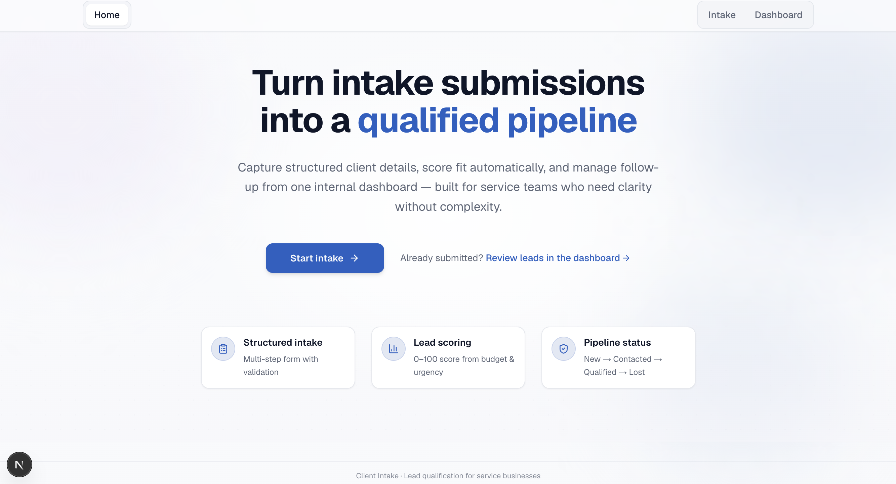
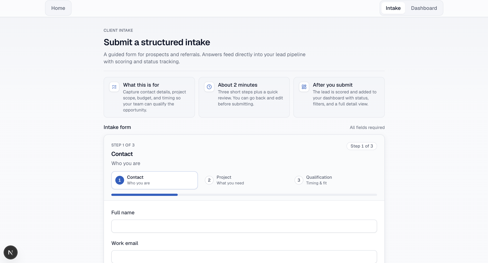
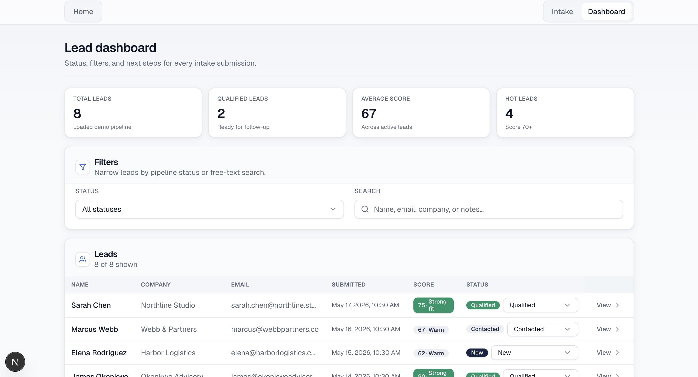

# Client Intake Dashboard

A modern internal lead intake and qualification dashboard built with Next.js, TypeScript, Tailwind CSS, and shadcn/ui.

This project is intentionally positioned as an internal operations/admin workflow prototype rather than a public SaaS marketing product.

The focus is on:

- structured intake workflows
- lead qualification
- operational visibility
- dashboard interactions
- maintainable frontend architecture
- modern React application patterns

---

## Preview

### Homepage


### Intake


### Dashboard


---

## Project Direction

This application is designed as an internal tool demo.

Meaning:

- the entire app acts as an internal/admin workflow prototype
- the intake page is simulated internally for demonstration purposes
- the homepage functions as a workflow entry point
- the dashboard acts as the primary operational interface

Instead of behaving like a marketing-heavy SaaS landing page, the application is intentionally closer to a lightweight internal business tool.

The goal of the project was to explore:

- operational UX patterns
- dashboard workflows
- lead qualification systems
- frontend application structure
- AI-assisted iterative development workflows
- product thinking and interface refinement

---

## Features

### Intake Workflow

- multi-step intake form
- structured lead collection
- form validation using Zod + React Hook Form
- qualification-oriented fields
- local persistence using localStorage

### Lead Dashboard

- lead overview table
- lead statuses
- filtering and sorting
- score visualization
- realistic demo data
- KPI summary cards

### Lead Qualification

- basic lead scoring system
- qualification workflow concepts
- urgency/budget/timeline scoring
- operational review flow

### UI/UX

- responsive dashboard layout
- modern internal-tool styling
- reusable component architecture
- iterative UX refinement
- simplified workflow hierarchy

---

## Tech Stack

### Frontend

- Next.js App Router
- React
- TypeScript
- Tailwind CSS
- shadcn/ui

### Forms & Validation

- React Hook Form
- Zod

### Utilities

- clsx
- class-variance-authority
- tailwind-merge

---

## What This Project Demonstrates

This repository was built to demonstrate:

- modern React stack usage
- Next.js App Router architecture
- TypeScript usage in a real UI workflow
- Tailwind + shadcn component composition
- form handling and validation
- state handling patterns
- dashboard UI implementation
- filtering and data presentation
- workflow-oriented product thinking
- frontend UX iteration
- maintainable project structure
- AI-assisted development workflows

The project intentionally focuses more on:

- product structure
- usability
- workflow clarity
- operational UI
- maintainable frontend systems

rather than visual overdesign or unnecessary complexity.

---

## Architecture Philosophy

The project intentionally avoids:

- overengineering
- unnecessary abstractions
- excessive state management
- premature backend complexity
- animation-heavy UI
- fake enterprise patterns

The goal was to keep the implementation:

- readable
- modular
- maintainable
- iterative
- realistic for production evolution

---

## Development Workflow

This project was developed iteratively using AI-assisted workflows.

Instead of generating the entire application in one pass, the project evolved through:

- phased implementation
- scoped prompts
- incremental UX refinement
- architecture review
- small logical commits
- iterative product decisions

This approach helped maintain:

- cleaner code organization
- more coherent UX
- better project direction
- simpler architecture

---

## Future Improvements

Potential future directions include:

- Persistent PostgreSQL storage
- Analytics overview dashboard
- AI-assisted lead qualification summaries
- CSV export and reporting
- Advanced filtering and pipeline management

---

## Running Locally

This repository uses [pnpm](https://pnpm.io/) (`pnpm-lock.yaml`). Install dependencies with:

```bash
pnpm install
```

Run the development server:

```bash
pnpm run dev
```

Then open:

http://localhost:3000

---

## Disclaimer

This project is a frontend/internal workflow prototype built for portfolio and architectural exploration purposes.

It is not intended to represent a complete production SaaS platform.

The focus is primarily on:

- frontend architecture
- operational workflow design
- dashboard UX
- maintainable React patterns
- modern tooling and development workflows

---

## Author

Fabio Coelho

---

## License

This project is licensed under the MIT License. See [LICENSE](LICENSE) for details.
